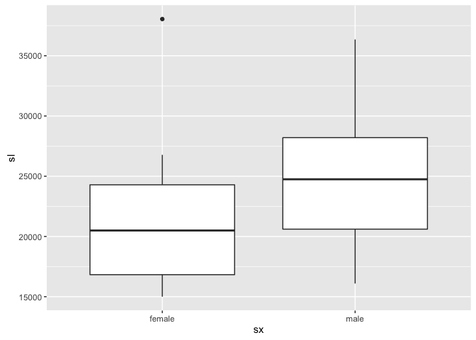
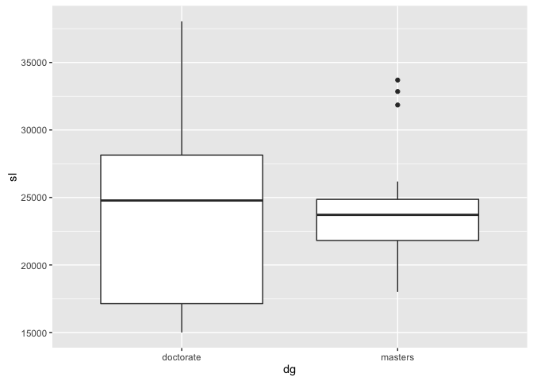
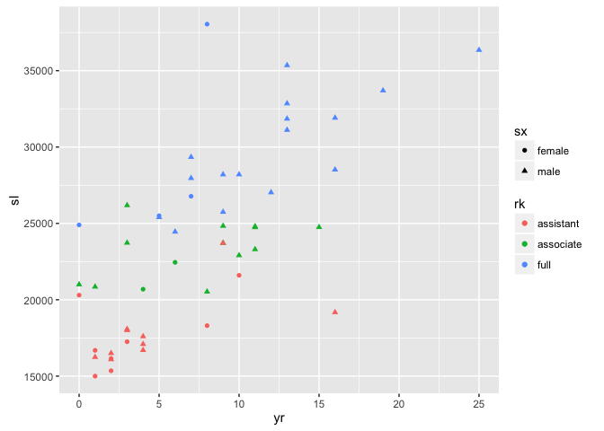
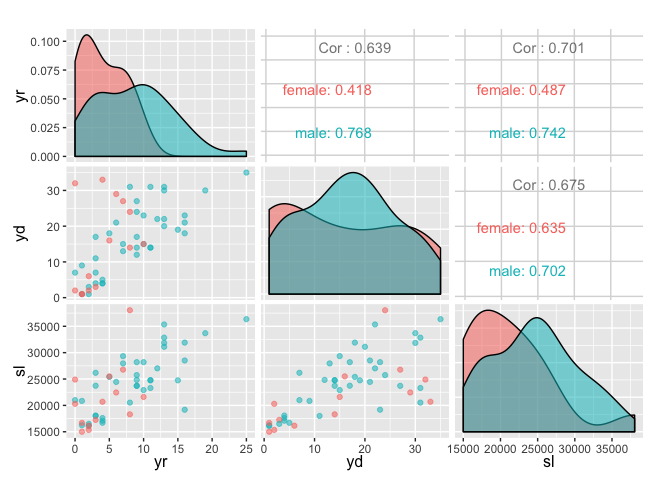
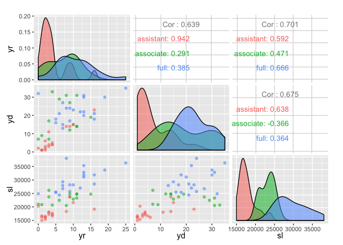
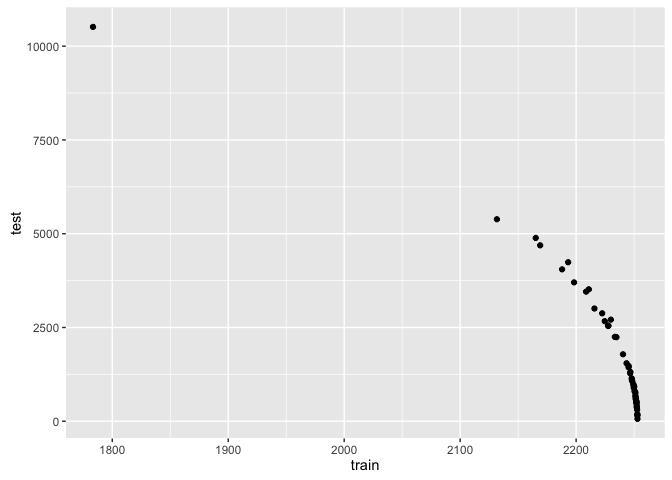
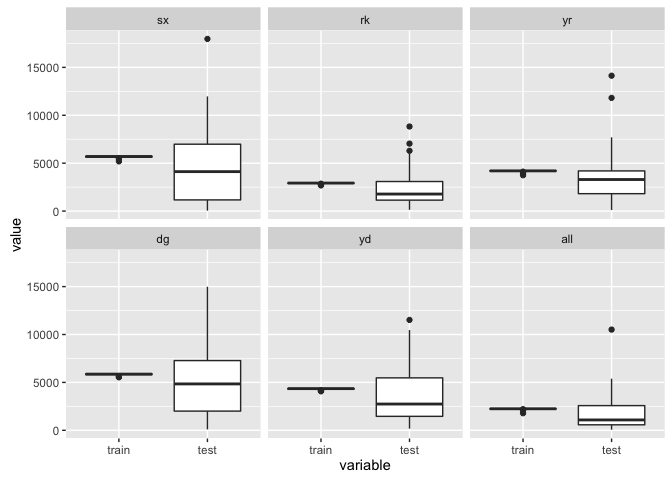
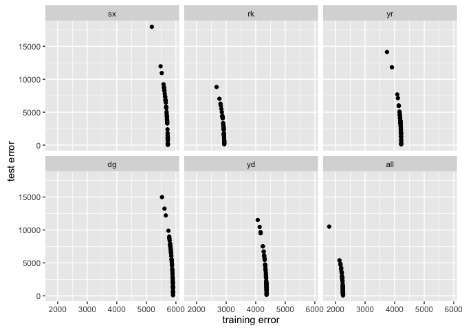
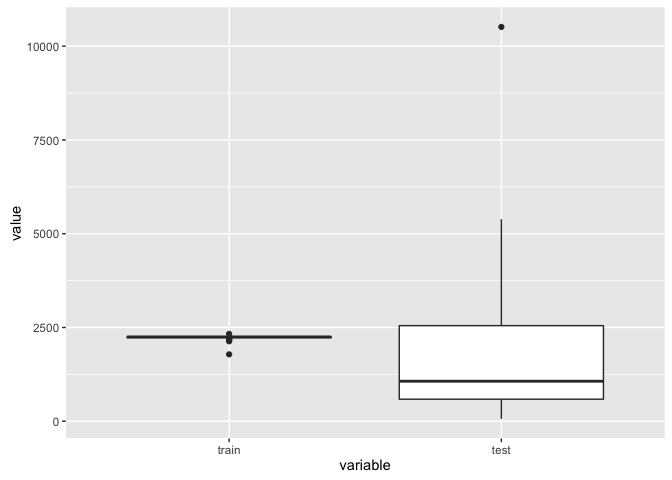
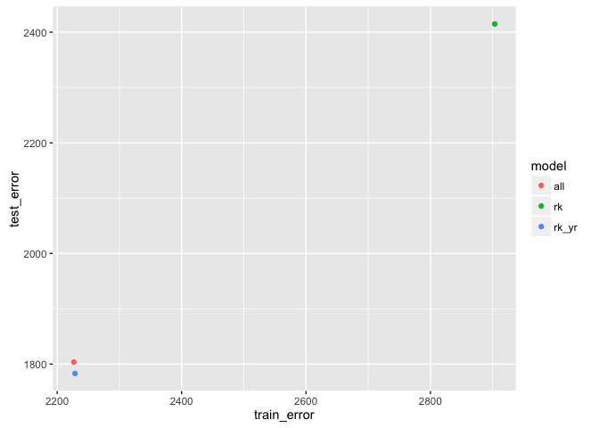

This is my activity for the [Data Science Learning Club Task 07: Linear
Regression](http://becomingadatascientist.com/learningclub/thread-160.html).

I mostly followed [this
tutorial](http://www.statmethods.net/stats/regression.html) for the
linear modeling part. With the plots and data summary (correlation &
statistical tests) I came up myself.

This document contains:

-   Ways to visualise datasets with numerical and categorical variables
-   Ways to display and find correlations between different types of
    variables
-   Links to more detailed explanations
-   Training of different linear models
-   Visualisation of trained models
-   Comparison of different models

Setup {#setup}
=====

This are the libraries for plotting and other analyses.

``` r
library(ggplot2)  # general plotting
library(GGally)  # ggpairs
library(knitr)  # to be able to use nice looking tables (kable()) 
library(heplots)  # for eta (ANOVA)
```

    ## Loading required package: car

``` r
library(reshape2)  # prepare data for ggplot2
library(scales)
```

Data {#data}
====

I used a dataset of salaries described
[here](http://data.princeton.edu/wws509/datasets/#salary). I downloaded
the txt file and since it was separated by multiple spaces I reformatted
it first. For this purpose I opened it in a text editor and replace " "
(two spaces) by " " (one space) repeatedly. Since there is still a space
before each row we could remove them manually or just ignore the first
column after reading it into R.

``` r
salary <- read.csv("/Volumes/Vero/Data/learning-club/regression/salary.dat.txt", 
    sep = " ")
salary <- salary[, -1]  # remove first column
```

The website of the dataset also contains a description of the variables.

-   sx = Sex, coded 1 for female and 0 for male
-   rk = Rank, coded \* 1 for assistant professor, \* 2 for associate
    professor, and \* 3 for full professor
-   yr = Number of years in current rank
-   dg = Highest degree, coded 1 if doctorate, 0 if masters
-   yd = Number of years since highest degree was earned
-   sl = Academic year salary, in dollars.

Correlation & Summary {#correlation-summary}
---------------------

First I want to get some information about how well my features
correlate with the target `salary`. [This stackexchange
answer](http://stats.stackexchange.com/a/112674/12947) gives an overview
over which tests to use in different situations (w.r.t. do datatype of
your features).

### Numerical data {#numerical-data}

First we want to find the correlation between our numerical features
`yr` and `yd` and our target `sl`.

``` r
kable(cor(salary[, c("yr", "yd", "sl")]), col.names = c("years rank", 
    "years degree", "salary"))
```

|     |  years rank|  years degree|     salary|
|-----|-----------:|-------------:|----------:|
| yr  |   1.0000000|     0.6387763|  0.7006690|
| yd  |   0.6387763|     1.0000000|  0.6748542|
| sl  |   0.7006690|     0.6748542|  1.0000000|

This can also be done for each pair of variables by using `cor.test`.
This takes many lines of code if you have many features but also
provides more information.

``` r
cor.test(x = salary[, "yr"], y = salary[, "sl"])
```

    ## 
    ##  Pearson's product-moment correlation
    ## 
    ## data:  salary[, "yr"] and salary[, "sl"]
    ## t = 6.944, df = 50, p-value = 7.341e-09
    ## alternative hypothesis: true correlation is not equal to 0
    ## 95 percent confidence interval:
    ##  0.5289014 0.8172925
    ## sample estimates:
    ##      cor 
    ## 0.700669

``` r
cor.test(x = salary[, "yd"], y = salary[, "sl"])
```

    ## 
    ##  Pearson's product-moment correlation
    ## 
    ## data:  salary[, "yd"] and salary[, "sl"]
    ## t = 6.4665, df = 50, p-value = 4.102e-08
    ## alternative hypothesis: true correlation is not equal to 0
    ## 95 percent confidence interval:
    ##  0.4926919 0.8003548
    ## sample estimates:
    ##       cor 
    ## 0.6748542

The variable `yr` (years with this rank) are more correlated with
**salary** than `yd` (years with degree).

### Categorical {#categorical}

To find correlations between categorical variables we can use
`chisq.test` (Chi-squared test for independence) or `fisher.test`
(Fisher's exact test). Because of my small sample size I chose
`fisher.test`.

``` r
sx_rk <- table(salary[, c("sx", "rk")])
sx_rk
```

    ##         rk
    ## sx       assistant associate full
    ##   female         8         2    4
    ##   male          10        12   16

``` r
fisher.test(x = as.matrix(sx_rk))
```

    ## 
    ##  Fisher's Exact Test for Count Data
    ## 
    ## data:  as.matrix(sx_rk)
    ## p-value = 0.1564
    ## alternative hypothesis: two.sided

We can not reject the null hypothesis, that the variables `sx` and `rk`
are independent.

### Categorical & Numerical data {#categorical-numerical-data}

Here I'll look at the correlation between the two categorical variables
(`sx` and `rk`) and the target `sl`.

``` r
ggplot(salary) + geom_boxplot(aes(x = sx, y = sl))
```

<!-- -->

``` r
ggplot(salary) + geom_boxplot(aes(x = rk, y = sl))
```

<!-- -->

``` r
ggplot(salary) + geom_boxplot(aes(x = dg, y = sl))
```

<!-- -->

[This stackexchange
answer](http://stats.stackexchange.com/questions/119835/correlation-between-a-nominal-iv-and-a-continuous-dv-variable/124618#124618)
provides a very good overview over possibilities. The author of this
answer describes the following approach where you use ANOVA to find the
correlation between `sl` and the *predicted* values of `sl` based on
`sx`. It is not directly possible to find a correlation since `sx` is
categorical.

``` r
model.aov <- aov(sl ~ sx, data = salary)
summary(model.aov)
```

    ##             Df    Sum Sq   Mean Sq F value Pr(>F)  
    ## sx           1 1.141e+08 114106220   3.413 0.0706 .
    ## Residuals   50 1.672e+09  33432473                 
    ## ---
    ## Signif. codes:  0 '***' 0.001 '**' 0.01 '*' 0.05 '.' 0.1 ' ' 1

``` r
etasq(model.aov, partial = FALSE)
```

    ##                eta^2
    ## sx        0.06389893
    ## Residuals         NA

``` r
model.aov <- aov(sl ~ rk, data = salary)
summary(model.aov)
```

    ##             Df    Sum Sq   Mean Sq F value   Pr(>F)    
    ## rk           2 1.347e+09 673391900   75.17 1.17e-15 ***
    ## Residuals   49 4.389e+08   8958083                     
    ## ---
    ## Signif. codes:  0 '***' 0.001 '**' 0.01 '*' 0.05 '.' 0.1 ' ' 1

``` r
etasq(model.aov, partial = FALSE)
```

    ##               eta^2
    ## rk        0.7541924
    ## Residuals        NA

``` r
model.aov <- aov(sl ~ dg, data = salary)
summary(model.aov)
```

    ##             Df    Sum Sq  Mean Sq F value Pr(>F)
    ## dg           1 8.682e+06  8681649   0.244  0.623
    ## Residuals   50 1.777e+09 35540964

``` r
etasq(model.aov, partial = FALSE)
```

    ##                 eta^2
    ## dg        0.004861681
    ## Residuals          NA

From the plots it looks like both `sx` (sex) and `rk` (rank) are
correlated with salary. The computed eta values, which can not be seen
as the correlation coefficient but give a similar idea of the data, it
looks like rank is more correlated with salary than sex. Since we also
not that sex and rank might not be independent, we can definitely not
say that there is a causal relationship between either sex and salary or
rank and salary.

`dg` (degree) does not seem to be very promising to contain information
about salary.

Visualisation {#visualisation}
-------------

Besides summaries and correlation analysis, visualisation is an import
step prior to training models. I have already shown a few plots above
and this section will show a few more plots.

In a dataset with more than two features you need to make decisions on
which features to plot. The y-axis should definitely depict the target
value and the x-axis one of the numerical values. I chose `yr` because
it's the one numerical variable that's correlated the most with salary.
Categorical values can easily be included by using different colors and
shapes.

``` r
ggplot(salary, aes(x = yr, y = sl, col = rk, shape = sx)) + geom_point()
```

<!-- -->

We can see in the above plot that most high-paying positions are held by
men, but those are also the ones that are in their position for the
longest time. It seems that rank is very influental on the salary (which
makes lot of sense).

For comparing I also created a pairs plot between all numerical columns
and used sex for coloring in one plot and rank in the second.

``` r
ggpairs(salary, mapping = aes(col = sx, alpha = 0.5), columns = which(colnames(salary) %in% 
    c("sl", "yd", "yr")))
```

<!-- -->

From the above plot you can see both variables show some positive
correlation with salary but that this correlation is not as high for
females as for males.

``` r
ggpairs(salary, mapping = aes(col = rk, alpha = 0.5), columns = which(colnames(salary) %in% 
    c("sl", "yd", "yr")))
```

<!-- -->
From this plot you can see that rank could be very helpful in
determining the salary since the three densities don't overlap too much.

Fit a simple model {#fit-a-simple-model}
==================

The simplest idea is to fit a model on all available features.

``` r
fit1 <- lm(sl ~ sx + rk + yr + dg + yd, data = salary)
```

``` r
set.seed(65848)
train_idx <- sample(1:nrow(salary), round(nrow(salary) * 0.75))
train <- salary[train_idx, ]
test <- salary[-train_idx, ]  # exclude all that are in train_idx
fit <- lm(sl ~ sx + yr, data = train)
```

Check out the model {#check-out-the-model}
-------------------

When we've trained a model, there are many functions to investigate this
model. In this section I am just trying each function from the tutorial.

`summary` shows a summary of the residuals, the coefficients and some
statistics. We can also see that our model actually only uses `yr` and
`sxmale`.

**Side note: R performs [dummy
coding](http://www.ats.ucla.edu/stat/r/library/contrast_coding.htm#dummy)
for categorical data.**

``` r
summary(fit)
```

    ## 
    ## Call:
    ## lm(formula = sl ~ sx + yr, data = train)
    ## 
    ## Residuals:
    ##    Min     1Q Median     3Q    Max 
    ##  -6576  -2964  -1301   2980  13165 
    ## 
    ## Coefficients:
    ##             Estimate Std. Error t value Pr(>|t|)    
    ## (Intercept)  17943.6     1410.9  12.718 7.01e-15 ***
    ## sxmale        -734.2     1633.4  -0.449    0.656    
    ## yr             867.1      128.5   6.746 7.09e-08 ***
    ## ---
    ## Signif. codes:  0 '***' 0.001 '**' 0.01 '*' 0.05 '.' 0.1 ' ' 1
    ## 
    ## Residual standard error: 4294 on 36 degrees of freedom
    ## Multiple R-squared:  0.5804, Adjusted R-squared:  0.5571 
    ## F-statistic:  24.9 on 2 and 36 DF,  p-value: 1.627e-07

We can also just look at the coefficients.

``` r
coefficients(fit)  # model coefficients
```

    ## (Intercept)      sxmale          yr 
    ##  17943.5744   -734.2240    867.0975

We can also compute confidence intervals for the model parameters.

``` r
confint(fit, level = 0.95)  # CIs for model parameters 
```

    ##                  2.5 %    97.5 %
    ## (Intercept) 15082.1218 20805.027
    ## sxmale      -4046.9918  2578.544
    ## yr            606.4193  1127.776

Sometimes it's also useful to see the prediction for all training
samples.

``` r
fitted(fit)  # predicted values
```

    ##       28       51       26       48        4       40       18       39 
    ## 22279.06 18810.67 21544.84 19677.77 24013.26 20677.74 26747.42 20677.74 
    ##       14       34        2       36       49       13       25        1 
    ## 25013.23 21411.96 28481.62 18076.45 18076.45 25013.23 25013.23 38886.79 
    ##       50        8       23        5       47       11       38       46 
    ## 18810.67 31082.91 23279.03 33684.20 19677.77 27614.52 20677.74 18943.55 
    ##        6       43        7       27       15       37       10       24 
    ## 31082.91 17209.35 17943.57 26747.42 25013.23 24880.35 28481.62 24880.35 
    ##       45       17       12       31       42       16       22 
    ## 18943.55 28481.62 30215.81 26614.55 19810.64 23279.03 24146.13

You can also look at the
[residual](https://en.wikipedia.org/wiki/Errors_and_residuals), the
difference between the **target** and the **predicted** value.

``` r
residuals(fit)  # residuals
```

    ##          28          51          26          48           4          40 
    ##  3220.93793 -3810.67190  3855.16196 -4327.76944  2761.74284 -3077.74050 
    ##          18          39          14          34           2          36 
    ## -2005.42331 -3977.74050 -1301.22822  -721.96453  6868.38160  2773.55214 
    ##          49          13          25           1          50           8 
    ## -1832.44786  3186.77178  -181.22822 -2536.78893 -2124.67190   826.08897 
    ##          23           5          47          11          38          46 
    ##  4679.96687    11.79633 -3527.76944  -589.52085 -3582.74050 -2849.54541 
    ##           6          43           7          27          15          37 
    ## -2566.91103  3789.64968  6956.42565 -1947.42331   734.77178 -6576.35471 
    ##          10          24          45          17          12          31 
    ##  4368.38160 13164.64529 -2443.54541  2632.38160 -5465.81349 -5014.54980 
    ##          42          16          22 
    ## -1810.64295  6062.96687 -3621.13068

With ANOVA performed on one model you can test the significance of the
model terms.

``` r
anova(fit)  # anova table 
```

    ## Analysis of Variance Table
    ## 
    ## Response: sl
    ##           Df    Sum Sq   Mean Sq F value    Pr(>F)    
    ## sx         1  78964707  78964707   4.283   0.04573 *  
    ## yr         1 839054169 839054169  45.510 7.086e-08 ***
    ## Residuals 36 663727618  18436878                      
    ## ---
    ## Signif. codes:  0 '***' 0.001 '**' 0.01 '*' 0.05 '.' 0.1 ' ' 1

The next method `vcov` gives you the variance-covariance matrix of the
model parameters.

``` r
vcov(fit)
```

    ##             (Intercept)     sxmale        yr
    ## (Intercept)  1990659.34 -1352137.9 -72091.13
    ## sxmale      -1352137.87  2668122.9 -74236.70
    ## yr            -72091.13   -74236.7  16520.88

The tutorial mentioned above also mentions the function `influence` but
it has so much output that I'll leave it out.

Create predictions {#create-predictions}
------------------

We just used 75% of the samples for training. On the remaining 25% we
can compute the test error (generalization error).

``` r
pred_test <- predict(fit, test)  # it automatically picks the right columns
sum((pred_test - test$sl)^2)  # residual sum of squares
```

    ## [1] 260923236

For comparison we need the error on the training set.

``` r
pred_train <- predict(fit, train)
sum((pred_train - train$sl)^2)
```

    ## [1] 663727618

More interesting for a user would be the mean error the model makes in
the currency of the salary and not the sum of the squared errors over
all samples.

``` r
sqrt(sum((pred_test - test$sl)^2)/length(pred_test))  # root mean squared error
```

    ## [1] 4480.069

``` r
sqrt(sum((pred_train - train$sl)^2)/length(pred_train))
```

    ## [1] 4125.367

Automate this process {#automate-this-process}
=====================

In general you want to train different models with different features
and you also want to train the same model several times on different
splits of the data (e.g. cross-validation,
leave-one-out-cross-validation). Therefore I wrote a method that trains
a model on the given training set and computes training and test error.
Also I have written a method to compute the residual sum of squares.

Residual sum of sqaures {#residual-sum-of-sqaures}
-----------------------

``` r
get_residual_sum_of_squares <- function(prediction, target) {
    return(sum((prediction - target)^2))
}
```

Root mean squared error {#root-mean-squared-error}
-----------------------

``` r
rmsd <- function(prediction, target) {
    return(sqrt(get_residual_sum_of_squares(prediction, target)/length(prediction)))
}
```

Build model and compute error {#build-model-and-compute-error}
-----------------------------

``` r
build_model <- function(train, test, features, target) {
    form <- as.formula(paste(target, "~", paste(features, collapse = "+")))  # this is a way to paste feature names dynamically into a formula
    fit <- lm(form, data = train)
    train_error <- rmsd(predict(fit, train), train[, target])
    test_error <- rmsd(predict(fit, test), test[, target])
    return(list(train_error = train_error, test_error = test_error, 
        model = fit))
}
```

Use `build_model` to automate training {#use-build_model-to-automate-training}
--------------------------------------

Here I manually perform **Leave One Out Cross Validation**. In the
tutorial I mentioned above they show how to use library `DAAG` to
automatically perform cross validation. The first model I build is using
all features.

``` r
train_order <- sample(nrow(salary))
CV <- list()
errors <- NULL
for (t in train_order) {
    CV[[length(CV) + 1]] <- build_model(salary[-t, ], salary[t, 
        ], c("yd", "sx", "rk", "yr", "dg"), "sl")
    errors <- rbind(errors, data.frame(train = CV[[length(CV)]]$train_error, 
        test = mean(CV[[length(CV)]]$test_error)))
}
```

``` r
errors_melt <- melt(errors, id.vars = NULL)
ggplot(errors_melt) + geom_boxplot(aes(x = variable, y = value))
```

<!-- -->

The test errors are more wide spread than the trainings errors but
interestingly the mean test error is below the mean training error.

``` r
ggplot(errors) + geom_point(aes(x = train, y = test))
```

<!-- -->

``` r
train_err_all <- mean(errors$train)
train_err_all
```

    ## [1] 2226.789

``` r
test_err_all <- mean(errors$test)
test_err_all
```

    ## [1] 1803.707

A small training error is usually associated with a higher test error,
which is very true for our dataset and model.

For comparison we can train a model separately for each feature to see
which performs best. **Please note:** Training a model on a cateogorical
value ends up assigning the mean salary value for each class.

``` r
CV_feat <- list()
featnames <- c("sx", "rk", "yr", "dg", "yd")
errors_feat <- NULL
for (f in featnames) {
    f_ix <- which(featnames == f)
    CV_feat[[f_ix]] <- list()
    for (t in train_order) {
        n <- length(CV_feat[[f_ix]]) + 1
        CV_feat[[f_ix]][[n]] <- build_model(salary[-t, ], salary[t, 
            ], f, "sl")
        errors_feat <- rbind(errors_feat, data.frame(train = CV_feat[[f_ix]][[n]]$train_error, 
            test = CV_feat[[f_ix]][[n]]$test_error, feat = f))
    }
}
```

For the next plot I split the it into subfigures by using `facet_wrap`.
For easier comparison I `rbind` the errors from the model with all
features to the errors on the new models.

``` r
ggplot(rbind(melt(errors_feat, id.vars = "feat"), data.frame(errors_melt, 
    feat = "all"))) + geom_boxplot(aes(x = variable, y = value)) + 
    facet_wrap(~feat)
```

<!-- -->

We can see that both the training and test error of the model with all
features is very similar to the model with only using the `rank`
variable. **Remember:** The trained model with all features did actually
end up having coefficients only for `rk` and `sxmale`.

``` r
ggplot(rbind(errors_feat, data.frame(errors, feat = "all"))) + 
    geom_point(aes(x = train, y = test)) + facet_wrap(~feat) + 
    xlab("training error") + ylab("test error")
```

<!-- -->

``` r
train_err <- aggregate(train ~ feat, errors_feat, mean)
test_err <- aggregate(test ~ feat, errors_feat, mean)
kable(cbind(train_err, test_err))
```

| feat |     train| feat |      test|
|:-----|---------:|:-----|---------:|
| sx   |  5666.814| sx   |  4642.107|
| rk   |  2903.396| rk   |  2414.847|
| yr   |  4178.864| yr   |  3510.738|
| dg   |  5843.340| dg   |  4982.842|
| yd   |  4322.132| yd   |  3542.347|

Saving the smallest (`rk`) for later reporting.

``` r
train_err_rk <- train_err[train_err$feat == "rk", "train"]
test_err_rk <- test_err[test_err$feat == "rk", "test"]
```

Build model on most promising features {#build-model-on-most-promising-features}
--------------------------------------

Ok, so this step is probably not the most scientific approach, but I'll
try to learn another model on two features that I think (from looking at
the visuals and the correlations) would work best.

From the numerical values, `yr` looked most promising and had the
highest correlation with salary. From the categorical values `rk` looked
most promsing.

``` r
CV_rkyr <- list()
errors_rkyr <- NULL
for (t in train_order) {
    CV_rkyr[[length(CV_rkyr) + 1]] <- build_model(salary[-t, 
        ], salary[t, ], c("rk", "yr"), "sl")
    errors_rkyr <- rbind(errors, data.frame(train = CV_rkyr[[length(CV_rkyr)]]$train_error, 
        test = mean(CV_rkyr[[length(CV_rkyr)]]$test_error)))
}
```

``` r
ggplot(melt(errors_rkyr, id.vars = NULL)) + geom_boxplot(aes(x = variable, 
    y = value))
```

<!-- -->

``` r
train_err_rkyr <- mean(errors_rkyr$train)
train_err_rkyr
```

    ## [1] 2228.708

``` r
test_err_rkyr <- mean(errors_rkyr$test)
test_err_rkyr
```

    ## [1] 1783.07

Build three most promising models {#build-three-most-promising-models}
---------------------------------

From looking at the training and test errors, I will pick the three most
promising *feature combinations* and train them again on the whole
dataset. This will not make much of a difference since for each model I
have only left out one sample each, but it would also not make sense to
randomly choose one model over the other. **More on how this should be
done in a real project with more samples can be found at the end of this
section.**

This will be the three models trained: \* Using only `rk` (outperformed
all other features in the single-feature approach) \* Using all features
\* Using `rk` and `yr`

``` r
model_errors <- data.frame(model = c("rk", "all", "rk_yr"), train_error = c(train_err_rk, 
    train_err_all, train_err_rkyr), test_error = c(test_err_rk, 
    test_err_all, test_err_rkyr))
kable(model_errors)
```

| model  |  train\_error|  test\_error|
|:-------|-------------:|------------:|
| rk     |      2903.396|     2414.847|
| all    |      2226.789|     1803.707|
| rk\_yr |      2228.708|     1783.070|

``` r
ggplot(model_errors) + geom_point(aes(x = train_error, y = test_error, 
    col = model))
```

<!-- -->

From this plot it actually looks like my intuition about the best
features was right.

The way how I defined `build_model` is not optimal for this because it
requires a test. I would still like to have a function that creates the
formula from the feature names and returns the model in one call.

``` r
train_model <- function(train, features, target) {
    form <- as.formula(paste(target, "~", paste(features, collapse = "+")))  # this is a way to paste feature names dynamically into a formula
    fit <- lm(form, data = train)
    return(fit)
}
```

``` r
model_all <- train_model(salary, featnames, "sl")
model_rk <- train_model(salary, "rk", "sl")
model_rkyr <- train_model(salary, c("rk", "yr"), "sl")
```

``` r
coefficients(model_all)
```

    ## (Intercept)      sxmale rkassociate      rkfull          yr   dgmasters 
    ##  16912.4208  -1166.3731   5292.3608  11118.7640    476.3090   1388.6133 
    ##          yd 
    ##   -124.5743

Interestingly, now the model takes into account mor then just `yr` and
`sxmale`. Also `dgmaster` is included although it not seem (from the
visualisations) that it had much influence.

``` r
coefficients(model_rk)
```

    ## (Intercept) rkassociate      rkfull 
    ##   17768.667    5407.262   11890.283

``` r
coefficients(model_rkyr)
```

    ## (Intercept) rkassociate      rkfull          yr 
    ##  16203.2682   4262.2847   9454.5232    375.6956

``` r
rmsd_all <- rmsd(predict(model_all, salary), salary$sl)
rmsd_rk <- rmsd(predict(model_rk, salary), salary$sl)
rmsd_rkyr <- rmsd(predict(model_rkyr, salary), salary$sl)
df <- data.frame(model = c("all", "rk", "rkyr"), rmsd = c(rmsd_all, 
    rmsd_rk, rmsd_rkyr))
kable(df)
```

| model |      rmsd|
|:------|---------:|
| all   |  2231.153|
| rk    |  2905.386|
| rkyr  |  2307.983|

From these numbers (**error on the training set**) it's obvious that the
model trained only on `rk` is not a good choice. Using the model with
`all` features might not be the best choice either. Although it has the
best RMSD (again: on the training set), it uses many features. Since
both models `model_all` and `model_rkyr` have almost the same performs,
I'd suggest to pick the **second best** model `model_rkyr` which could
prevent overfitting by keeping the model *simple*.

### Attention - model selection {#attention---model-selection}

How I trained and chose the final model is not exactly the correct way.
In general I would put aside a **holdout set** of 10-20 % of the
samples. On the other set I would perform cross validation (k-fold or
leave one out CV) and then retrain the most promising models on the
everything **except** the holdout set. Than I would have, let's say, 3
promising models and the final decision which model to chose would be
determined by performance on the completely unseen holdout set.
Unfortunately there are only 52 samples in this set, so defining a
holdout set would probably be just very random and could also help
picking the wrong model.

Further notes {#further-notes}
=============

[Here](http://docs.ggplot2.org/0.9.3.1/fortify.lm.html) a list of plots
that can be performed to get more insight into a model. I did not yet
have time to look into them and understand them. [This stackoverflow
answer](http://stats.stackexchange.com/a/65864/12947) gives lots of
insights in how to interpret such plots, currently it's still on my
to-read list.
